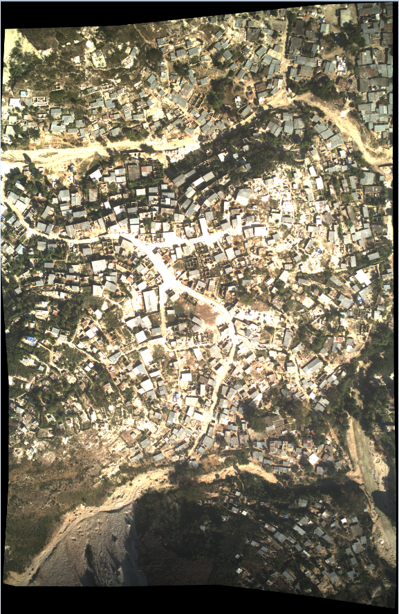
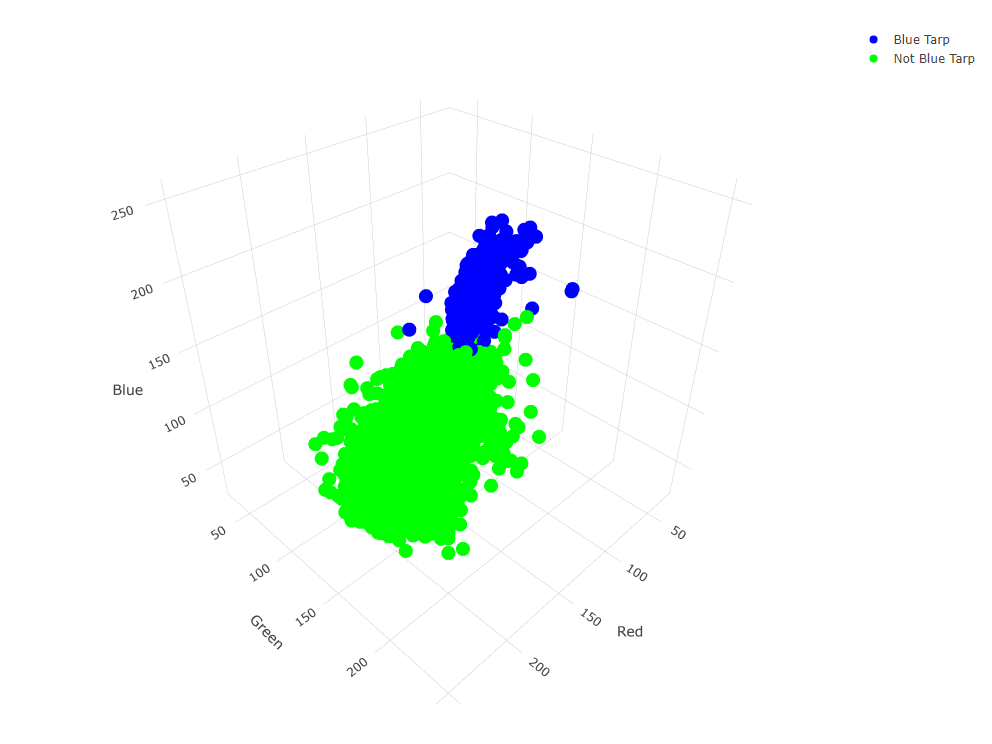
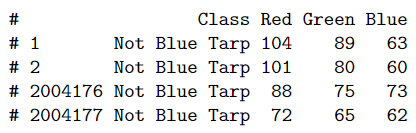
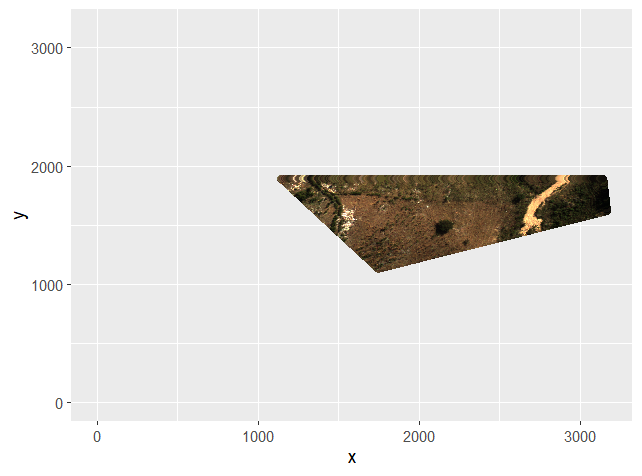
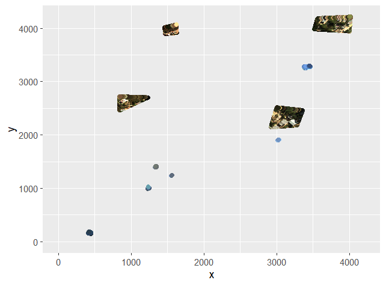
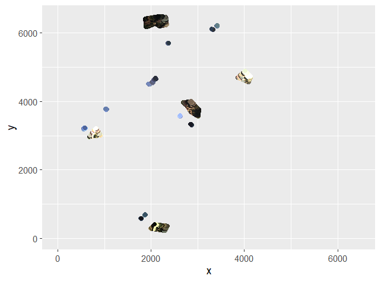

<!--- Below are global settings for knitr. You can override any of them by adding the changes to individual chunks --->
```{r global_options, include = FALSE}
# This chunk is called global_options. Due to `include = FALSE`, when the document is rendered, the chunk will be executed, but the results and code will not be included in the rendered document
knitr::opts_chunk$set(
    error = FALSE, # Keep compiling upon error
    collapse = FALSE, # code and corresponding output appear in knit file in separate blocks
    echo = FALSE, # echo code by default
    comment = "#", # change comment character
    #fig.width = 5.5, # set figure width
    fig.align = "center", # set figure position
    #out.width = "49%", # set width of displayed images
    warning = TRUE, # do not show R warnings
    message = TRUE # do not show R messages
)
```

# Introduction

In this project, we build a model that would help us locate people displaced by the earthquake in Haiti in $2010$. More specifically, we build in a timely manner an accurate model that classifies pixels in geo-referenced aerial images of Haiti in $2010$ as depicting blue tarps or depicting objects that are not blue tarps. People whose homes were destroyed by the earthquake often created temporary shelters using blue tarps. Blue tarps were good indicators of where displaced people lived.

# Data

Our training and holdout data were collected likely by applying a Region Of Interest (ROI) Tool to high-resolution, orthorectified / geo-referenced images of Haiti in 2010. Our training image is presented below and is sourced from `HaitiOrthorectifiedImage.tif` at [Pixel Values from Images over Haiti](https://www.kaggle.com/datasets/billbasener/pixel-values-from-images-over-haiti?datasetId=1899167). One ROI tool is described at [Region of Interest (ROI) Tool](https://www.l3harrisgeospatial.com/docs/regionofinteresttool.html). Classes may be assigned to pixels by defining Regions Of Interest.

{#id .class height=25%}

According to [What is orthorectified imagery?](https://www.esri.com/about/newsroom/insider/what-is-orthorectified-imagery/), an orthorectified image is an accurately georeferenced image that has been processed so that all pixels are in an accurate $(x, y)$ position on the ground. Orthorectified images have been processed to apply corrections for optical distortions from the sensor system, and apparent changes in the position of ground objects caused by the perspective of the sensor view angle and ground terrain.

Our training data is sourced from a CSV file like `HaitiPixels.csv` at [Pixel Values from Images over Haiti](https://www.kaggle.com/datasets/billbasener/pixel-values-from-images-over-haiti?datasetId=1899167). Our training data consists of $63,241$ observations. Each training observation consists of a class in the set $\{Vegetation, \ Soil, \ Rooftop, \ Various \ Non-Tarp, \ Blue \ Tarp\}$ and a pixel. A pixel is a colored dot. A pixel is represented by a tuple of intensities of color $Red$, $Green$, and $Blue$ in the range $0$ to $255$. See below first and last two rows of our training data.


```{r, eval = FALSE}
training_data_frame_of_classes_and_pixels <- read.csv(
    file = "Training_Data_Frame_Of_Classes_And_Pixels.csv"
)
rbind(
    head(x = training_data_frame_of_classes_and_pixels, n = 2),
    tail(x = training_data_frame_of_classes_and_pixels, n = 2)
)
```

We conduct exploratory data analysis by considering the distributions of intensities of color $Red$, $Green$, and $Blue$ in our training data. The distribution of intensity of color $Red$ is normal except for a relatively high proportion of high intensities. The distributions of intensity of colors $Green$ and $Blue$ each have two hills and are not normal.

Please explore [TomLeversRPackage](https://github.com/tslever/Tom_Levers_Public_Git_Repository/tree/main/R/TomLeversRPackage).


```{r, eval = FALSE, fig.cap = "Distribution Of Intensities Of Colors In Training Data", fig.width = 7, fig.height = 2.5}
library(TomLeversRPackage)
library(gridExtra)
distribution_of_intensities_of_red_in_training_data <- 
    plot_distribution(training_data_frame_of_classes_and_pixels, "Red", "red")
distribution_of_intensities_of_green_in_training_data <- 
    plot_distribution(training_data_frame_of_classes_and_pixels, "Green", "green")
distribution_of_intensities_of_blue_in_training_data <- 
    plot_distribution(training_data_frame_of_classes_and_pixels, "Blue", "blue")
grid.arrange(
    distribution_of_intensities_of_red_in_training_data, 
    distribution_of_intensities_of_green_in_training_data, 
    distribution_of_intensities_of_blue_in_training_data,
    ncol = 3
)
```

We examine in the left figure below the distribution of classes (such as $Blue \ Tarp$) in our training data in a space defined by intensities of color $Red$, $Green$, and $Blue$. The intensity space for pixels representing blue tarps is distinct from the intensity space for pixels representing objects that are not blue tarps.

{#id .class height=25%}
{#id .class height=25%}

```{r, eval = FALSE, fig.cap = "Distribution Of Classes In Intensity Space"}
distribution_of_training_classes_in_intensity_space <- plotly::plot_ly(
    data = training_data_frame_of_classes_and_pixels,
    x = ~Red,
    y = ~Green,
    z = ~Blue,
    color = ~Class,
    type = "scatter3d",
    mode = "markers",
    colors = c("blue", "black", "brown", "orange", "green")
)
htmlwidgets::saveWidget(
    widget = distribution_of_training_classes_in_intensity_space,
    file = "Distribution_Of_Training_Classes_In_Intensity_Space.html"
)
webshot2::webshot(
    url = "Distribution_Of_Training_Classes_In_Intensity_Space.html",
    file = "Distribution_Of_Training_Classes_In_Intensity_Space.png"
)
```

Our holdout data is sourced from CSV files like

- `orthovnir057_ROI_NON_Blue_Tarps.txt`
- `orthovnir067_ROI_Blue_Tarps.txt`
- `orthovnir067_ROI_NOT_Blue_Tarps.txt`
- `orthovnir069_ROI_Blue_Tarps.txt`
- `orthovnir069_ROI_NOT_Blue_Tarps.txt`
- `orthovnir078_ROI_NON_Blue_Tarps.txt`

at [Pixel Values from Images over Haiti](https://www.kaggle.com/datasets/billbasener/pixel-values-from-images-over-haiti?datasetId=1899167) and from Dr. Peter Gedeck

- `orthovnir078_ROI_Blue_Tarps.txt`

`orthovnir067_ROI_Blue_Tarps_data.txt` from Dr. Gedeck is a duplicate of `orthovnir067_ROI_Blue_Tarps.txt`. Each holdout observation consists of a class in the set $\{Not \ Blue \ Tarp, \ Blue \ Tarp\}$ and a pixel. The class of an observation is determined according to the name of the source of that observation. See below first and last two rows of our holdout data.



```{r, eval = FALSE}
holdout_data_frame_of_classes_and_pixels <- read.csv(
    file = "./Holdout_Data/Holdout_Data_Frame_Of_Classes_And_Pixels.csv"
)
rbind(
    head(x = holdout_data_frame_of_classes_and_pixels, n = 2),
    tail(x = holdout_data_frame_of_classes_and_pixels, n = 2)
)
```

We assume that columns $B1$, $B2$, and $B3$ in the above source files correspond to intensities of colors $Red$, $Green$, and $Blue$. Values in these columns vary from $255$ down to $27$, $28$, and $25$. Partial reconstructions of images of Regions 57, 67, 69, and 78 based on columns $B1$, $B2$, $B3$, $X$, and $Y$ from our holdout source files look realistic.

{#id .class height=12%}
{#id .class height=12%}
{#id .class height=12%}
{#id .class height=12%}

We conduct exploratory data analysis by considering the distributions of intensities of color $Red$, $Green$, and $Blue$ in our holdout data. The distributions of intensity of colors $Red$, $Green$ and $Blue$ are normal and broad relative to our training distributions. Our holdout distributions have long right tails and relatively high proportions of high intensities.


```{r, eval = FALSE}
number_of_training_observations <- nrow(training_data_frame_of_classes_and_pixels)
number_of_holdout_observations <- nrow(holdout_data_frame_of_classes_and_pixels)
```

```{r, eval = FALSE, fig.width = 7, fig.height = 2.5}
library(TomLeversRPackage)
library(gridExtra)
set.seed(1)
vector_of_random_indices <- sample(
    x = 1:number_of_holdout_observations,
    size = number_of_training_observations
)
slice_of_holdout_data_frame <- holdout_data_frame_of_classes_and_pixels[vector_of_random_indices, ]
distribution_of_intensities_of_red_in_holdout_data <- 
    plot_distribution(slice_of_holdout_data_frame, "Red", "red")
distribution_of_intensities_of_green_in_holdout_data <- 
    plot_distribution(slice_of_holdout_data_frame, "Green", "green")
distribution_of_intensities_of_blue_in_holdout_data <- 
    plot_distribution(slice_of_holdout_data_frame, "Blue", "blue")
grid.arrange(
    distribution_of_intensities_of_red_in_holdout_data, 
    distribution_of_intensities_of_green_in_holdout_data, 
    distribution_of_intensities_of_blue_in_holdout_data,
    ncol = 3
)
```

We examine in the right figure above the distribution of classes-- i.e., $Not \ Blue \ Tarp$ and $Blue \ Tarp$ --in our holdout data in a space defined by intensities of color $Red$, $Green$, and $Blue$. The intensity space for pixels representing blue tarps is distinct from the intensity space for pixels representing objects that are not blue tarps.

```{r, eval = FALSE, fig.cap = "Distribution Of Classes In Intensity Space", echo = FALSE}
distribution_of_holdout_classes_in_intensity_space <- plotly::plot_ly(
    data = slice_of_holdout_data_frame,
    x = ~Red,
    y = ~Green,
    z = ~Blue,
    color = ~Class,
    type = "scatter3d",
    mode = "markers",
    colors = c("blue", "black", "brown", "orange", "green")
)
htmlwidgets::saveWidget(
    widget = distribution_of_holdout_classes_in_intensity_space,
    file = "Distribution_Of_Holdout_Classes_In_Intensity_Space.html"
)
webshot2::webshot(
    url = "Distribution_Of_Holdout_Classes_In_Intensity_Space.html",
    file = "Distribution_Of_Holdout_Classes_In_Intensity_Space.png"
)
```

The proportion of training observations that correspond to blue tarps is about $4.4$ times the proportion of holdout observations that correspond to blue tarps.

```{r, eval = FALSE}
number_of_training_observations_corresponding_to_blue_tarps <- nrow(
    training_data_frame_of_classes_and_pixels[
        training_data_frame_of_classes_and_pixels$Class == "Blue Tarp",
    ]
)
number_of_holdout_observations_corresponding_to_blue_tarps <- nrow(
    holdout_data_frame_of_classes_and_pixels[
        holdout_data_frame_of_classes_and_pixels$Class == "Blue Tarp",
    ]
)
proportion_of_training_observations_that_correspond_to_blue_tarps <- 
    number_of_training_observations_corresponding_to_blue_tarps /
    number_of_training_observations
proportion_of_holdout_observations_that_correspond_to_blue_tarps <-
    number_of_holdout_observations_corresponding_to_blue_tarps /
    number_of_holdout_observations
proportion_of_training_observations_that_correspond_to_blue_tarps /
    proportion_of_holdout_observations_that_correspond_to_blue_tarps
```

We expect that, due to bias, a binary classifier trained on our training data frame of indicators and pixels below and cross validated on our holdout data frame of indicators and pixels below will have a maximum average F1 measure that is less than that of a binary classifier cross validated on our training data frame. We recommend training on our composite data frame of indicators and pixels below.

# Methods

## Choosing A Binary Classifier

Since the intensity space for pixels representing blue tarps is distinct from the intensity space for pixels representing objects that are not blue tarps, we consider our optimal model to be a binary classifier that classifies pixels as depicting blue tarps or depicting objects that are not blue tarps. We may ignore non-binary classifiers that predict probabilities for all classes and may be used to locate pixels that more likely depict blue tarps than objects that are not blue tarps.

## Choosing A Performance Metric

A threshold is a probability. A model classifies a pixel as representing a blue tarp if the probability that the pixel represents a blue tarp that the model predicts is greater than the threshold. False Positive Rate (FPR) is the ratio of false positives to actual negatives. Precision / Positive Predictive Value (PPV) is the ratio of true positives to predicted positives. Recall / True Positive Rate (TPR) is the ratio of true positives to actual positives. An F1 measure is the harmonic mean of PPV and TPR. A decimal of true positives is the ratio of number of true positives to total number of predictions. All of these quantities lie between $0$ and $1$.

Receiver Operator Characteristic (ROC) graphs are graphs of TPR Vs. FPR for different thresholds. According to [ROC and AUC, Clearly Explained!](https://www.youtube.com/watch?v=4jRBRDbJemM), the Area Under The Curve (AUC) of an ROC graph "makes it easy to compare one ROC curve to another" and to compare one binary classifier to another. If the AUC for one ROC curve is greater than the AUC for another ROC curve, the classifier with the former ROC curve is better than the classifier with the latter ROC curve. A given classifier's threshold may be tuned so that its FPR is close to $0$ and its TPR is close to $1$. We may consider maximizing ROC AUC among classifiers and tuning a classifier's threshold to minimize the distance between the corresponding point (FPR, TPR) and (0, 1).

"People often replace the False Positive Rate with Precision... If there were lots of samples that were not [Blue Tarps] relative to the number of [Blue Tarp] samples, then Precision might be more useful than the False Positive Rate. This is because Precision does not include the number of True Negatives in its calculation, and is not effected by the imbalance. In practice, this sort of imbalance occurs when studying a rare [occurrence]. In this case, the study will contain many more [pixels not corresponding to blue tarps than corresponding to blue tarps]. We may consider maximizing PR AUC among classifiers and tuning a classifier's threshold to minimize the distance between the corresponding point (TPR, PR) and (1, 1).

According to [Category graph: Precision-Recall vs. Threshold](https://www.ibm.com/docs/en/contentclassificatio/8.8?topic=analysis-category-graph-precision-recall-vs-threshold), "The ideal threshold setting is the highest possible recall and precision rate. This goal is not always achievable, because the higher the recall rate, the lower the precision rate, and vice versa. Setting the most appropriate threshold for a category is a trade-off between these two rates."

According to [Optimal Thresholding of Classifiers to Maximize F1 Measure](https://www.ncbi.nlm.nih.gov/pmc/articles/PMC4442797/), "The [balanced] harmonic mean of precision and recall, the F1 measure is widely used to evaluate the success of a binary classifier when one class is rare." According to [The truth of the F-measure](chrome-extension://efaidnbmnnnibpcajpcglclefindmkaj/https://www.cs.odu.edu/~mukka/cs795sum11dm/Lecturenotes/Day3/F-measure-YS-26Oct07.pdf), "the F-measure was first introduced to evaluation tasks of information extraction technology at the Fourth Message Understanding Conference (MUC-4) in 1992."

The average of two ratios (e.g., precision and recall) is the balanced harmonic mean of those two ratios. According to [Harmonic mean](https://en.wikipedia.org/wiki/Harmonic_mean), "For instance, if a vehicle travels a certain distance $d$ outbound at a speed $s_1$ (e.g., $60 \ km/h$) and returns the distance at a speed $s_2$ (e.g., $20 \ km/h$), then its average speed is the harmonic mean of $s_1$ and $s_2$ ($30 \ km/h$), not the arithmetic mean ($40 \ km/h$). The total travel time is the same as if it had traveled the whole distance at that average speed. This can be proven as follows:
$$Average \ speed \ for \ the \ entire \ journey = \frac{Total \ distance \ traveled}{Sum \ of \ time \ for \ each \ segment} = \frac{D}{T} = \frac{D}{t_1 + t_2} = \frac{2d}{\frac{d}{s_1} + \frac{d}{s_2}} = \frac{2}{\frac{1}{s_1} + \frac{1}{s_2}}$$

"[I]f each sub-trip covers the same distance, then the average speed is the [balanced] harmonic mean of [each] sub-trip speed." If one sub-trip covers a greater distance than the other sub-trip, "then a weighted harmonic mean is needed." To return to the F1 measure, if each of precision and recall has the same weight, then the F1 measure is the balanced harmonic mean of each of precision and recall. This balanced harmonic mean is
$$F1 = \frac{2}{\frac{1}{P} + \frac{1}{R}}$$

If recall has more weight than precision, then a weighted harmonic mean is needed. This weighted harmonic mean is
$$F_{w_P, \ w_R} = \frac{w_P + w_R}{\frac{w_P}{P} + \frac{w_R}{R}}$$
When searching for our optimal binary classifier, we choose as our optimal binary classifier the binary classifier with the highest F1 measure and $F_{w_P = 1, \ w_R = 1}$.

Regarding the weight of PPV and the weight of TPR, we prioritize TPR at least as much as PPV. We prioritize identifying as many pixels corresponding to blue tarps correctly as possible at least as much as having predictions that pixels correspond to blue tarps be correct. As we move toward providing resources for refugees, we may wish to prioritize identifying as many pixels corresponding to blue tarps as possible more than having predictions that pixels correspond to blue tarps be correct.

## Data Frame For Modeling

In order to build binary classifiers, we create a composite data frame of our training data and our holdout data; substitute a column of classes for a column of indicators of whether of not a pixel depicts a blue tarp; add columns corresponding to normalized intensities and intensities normalized after transforming by the natural logarithm, the square root, the square, and interactions; and divide the composite data frame into training and holdout data frames again. We normalize as opposed to standardize intensities given that distributions of intensity are not normal. We shuffle our training and holdout data. See below the first observation in our training data frame of indicators and pixels.


```{r, eval = FALSE}
training_data_frame_of_indicators_and_pixels <- NULL
holdout_data_frame_of_indicators_and_pixels <- NULL
should_generate_training_and_holdout_data_frames_of_indicators_and_pixels <- FALSE
if (should_generate_training_and_holdout_data_frames_of_indicators_and_pixels) {
    composite_data_frame_of_classes_and_pixels <- rbind(
        training_data_frame_of_classes_and_pixels,
        holdout_data_frame_of_classes_and_pixels
    )
    number_of_training_and_holdout_observations <-
        nrow(composite_data_frame_of_classes_and_pixels)
    column_of_indicators <- rep(0, number_of_training_and_holdout_observations)
    condition <- composite_data_frame_of_classes_and_pixels$Class == "Blue Tarp"
    column_of_indicators[condition] <- 1
    factor_of_indicators <- factor(column_of_indicators)
    composite_data_frame_of_indicators_and_pixels <- data.frame(
        Indicator = factor_of_indicators,
        Normalized_Red = normalize_vector(composite_data_frame_of_classes_and_pixels[, "Red"]),
        Normalized_Green = normalize_vector(composite_data_frame_of_classes_and_pixels[, "Green"]),
        Normalized_Blue = normalize_vector(composite_data_frame_of_classes_and_pixels[, "Blue"]),
        Normalized_Natural_Logarithm_Of_Red =
            normalize_vector(log(composite_data_frame_of_classes_and_pixels[, "Red"])),
        Normalized_Natural_Logarithm_Of_Green =
            normalize_vector(log(composite_data_frame_of_classes_and_pixels[, "Green"])),
        Normalized_Natural_Logarithm_Of_Blue =
            normalize_vector(log(composite_data_frame_of_classes_and_pixels[, "Blue"])),
        Normalized_Square_Root_Of_Red =
            normalize_vector(sqrt(composite_data_frame_of_classes_and_pixels[, "Red"])),
        Normalized_Square_Root_Of_Green =
            normalize_vector(sqrt(composite_data_frame_of_classes_and_pixels[, "Green"])),
        Normalized_Square_Root_Of_Blue =
            normalize_vector(sqrt(composite_data_frame_of_classes_and_pixels[, "Blue"])),
        Normalized_Square_Of_Red =
            normalize_vector(I(composite_data_frame_of_classes_and_pixels[, "Red"]^2)),
        Normalized_Square_Of_Green =
            normalize_vector(I(composite_data_frame_of_classes_and_pixels[, "Green"]^2)),
        Normalized_Square_Of_Blue =
            normalize_vector(I(composite_data_frame_of_classes_and_pixels[, "Blue"]^2)),
        Normalized_Interaction_Of_Red_And_Green = normalize_vector(
            as.numeric(
                interaction(
                    composite_data_frame_of_classes_and_pixels$Red,
                    composite_data_frame_of_classes_and_pixels$Green
                )
            )
        ),
        Normalized_Interaction_Of_Red_And_Blue = normalize_vector(
            as.numeric(
                interaction(
                    composite_data_frame_of_classes_and_pixels$Red,
                    composite_data_frame_of_classes_and_pixels$Blue
                )
            )
        ),
        Normalized_Interaction_Of_Green_And_Blue = normalize_vector(
            as.numeric(
                interaction(
                    composite_data_frame_of_classes_and_pixels$Green,
                    composite_data_frame_of_classes_and_pixels$Blue
                )
            )
        )
    )
    training_data_frame_of_indicators_and_pixels <- 
        composite_data_frame_of_indicators_and_pixels[1:number_of_training_observations, ]
    holdout_data_frame_of_indicators_and_pixels <-
        composite_data_frame_of_indicators_and_pixels[
            (number_of_training_observations + 1):
            number_of_training_and_holdout_observations,
        ]
    set.seed(1)
    vector_of_random_indices <- sample(1:number_of_training_observations)
    training_data_frame_of_indicators_and_pixels <-
        training_data_frame_of_indicators_and_pixels[vector_of_random_indices, ]
    set.seed(1)
    vector_of_random_indices <- sample(1:number_of_holdout_observations)
    holdout_data_frame_of_indicators_and_pixels <-
        holdout_data_frame_of_indicators_and_pixels[vector_of_random_indices, ]
    write.csv(
        training_data_frame_of_indicators_and_pixels,
        "Training_Data_Frame_Of_Indicators_And_Pixels.csv",
        row.names = FALSE
    )
    write.csv(
        holdout_data_frame_of_indicators_and_pixels,
        "./Holdout_Data/Holdout_Data_Frame_Of_Indicators_And_Pixels.csv",
        row.names = FALSE
    )
} else {
    training_data_frame_of_indicators_and_pixels <-
        read.csv("Training_Data_Frame_Of_Indicators_And_Pixels.csv", header = TRUE)
    training_data_frame_of_indicators_and_pixels$Indicator <-
        factor(training_data_frame_of_indicators_and_pixels$Indicator)
    holdout_data_frame_of_indicators_and_pixels <-
        read.csv("./Holdout_Data/Holdout_Data_Frame_Of_Indicators_And_Pixels.csv", header = TRUE)
    holdout_data_frame_of_indicators_and_pixels$Indicator <-
        factor(holdout_data_frame_of_indicators_and_pixels$Indicator)
}
t(training_data_frame_of_indicators_and_pixels[1, ])
```

## Grid Search

### Dimensions

#### First Dimension: Type Of Classifier

We conduct a grid search for an optimal binary classifier according to the F1 measure. The first dimension of our grid is type of classifier. We compare Logistic Regression (LR) classifiers, Logistic Ridge Regression (LRR) classifiers, Linear Discriminant Analyses (LDA), Quadratic Discriminant Analyses (QDA), K Nearest Neighbors (KNN) classifiers, Random Forests (RF), Support-Vector Machines With Linear Kernel (SVMWLK), Support-Vector Machines With Polynomial Kernel (SVMWPK), and Support-Vector Machines With Radial Kernel (SVMWRK). Generally speaking, LR classifiers, LRR classifiers, LDA's, and QDA's are relatively inflexible with high bias and low variance; KNN classifiers, RF's, and SVMWLK's are relatively flexible with low bias and high variance. KNN classifiers may be flexible when $K$ is approximately $1$ or inflexible as $K$ approaches the number of observations in our training data.

#### Second Dimension: Set Of Predictive Terms

The second dimension of our grid is set of predictive terms. We consider classifiers with the terms in the above output other than $Indicator$. Per University Of Virginia courses Linear Models For Data Science and Statistical Learning, these predictive terms involve common transformations of predictors.

#### Third Dimension: Value Of Primary Hyperparameter

The third dimension of our grid is value of primary hyperparameter. For LRR classifiers, the primary hyperparameter is $\lambda$. LRR classifiers are penalized for inclusion of predictive terms proportionally to $\lambda$; setting $\lambda$ to be greater than $0$ may decrease the variance and increase the performance of LRR classifiers.

For KNN classifiers, the primary hyperparameter is $K$. The class of a test observation depends on determining the classes of the $K$ nearest neighboring observations in the training data. A KNN classifier with $K = 1$ is relatively flexible with low bias and high variance; such a model may overfit the training data and identify patterns with performance that is less than ideal. A KNN classifier with $K = n$, the number of training observations, predicts that all observations have one class and has high bias and low variance. A KNN classifier with $1 < K < n$ may perform best.

For RF's, the primary hyperparameter is $mtry$, the number of variables randomly sampled as candidates at each split / fraction of features available at each split. According to Dr. Bill Basener, "by selecting only some of the features for each split, we make our trees to be different from each other. We're creating more variety among our trees and are decorrelating the trees... [mtry] is probably the most important parameter... for a random forest. And the way this works: A lower fraction creates more decorrelation among the trees. So the trees are more different. But it also creates lower accuracy in the individual trees because they don't have as many parameters to select from for their classification. And so there's a bit of a tradeoff there."

For SVM's, the primary hyperparameter is cost $C$. According to *An Introduction to Statistical Learning (Second Edition)* (James et al. 2023), "Cost $C$ is a nonnegative tuning parameter... $C$ determines the number and severity of the violations to the margin (and to the hyperplane) that we will tolerate. We can think of $C$ as a budget for the amount that the margin can be violated by the $n$ observations. If $C = 0$ then there is no budget for violations to the margin... For $C > 0$ no more than $C$ observations can be on the wrong side of the hyperplane... As the budget $C$ increases, we become more tolerant of violations to the margin, and so the margin will widen. Conversely, as $C$ decreases, we become less tolerant of violations to the margin and so the margin narrows...

$C$ controls the bias-variance trade-off of a support-vector [machine]. When $C$ is small, we seek narrow margins that are rarely violated; this amounts to a classifier that is highly fit to the data, which may have low bias but high variance. On the other hand, when $C$ is larger, the margin is wide and we allow more violations to it; this amounts to fitting the data less hard and obtaining a classifier that is potentially more biased but may have lower variance...

When the tuning parameter $C$ is large, then the margin is wide, many observations violate the margin, and so there are many support vectors. In this case, many observations are involved in determining the hyperplane. This classifier has low variance (since many observations are support vectors) but potentially high bias. In contrast, if $C$ is small, then there will be fewer support vectors and hence the resulting classifier will have low bias but high variance...

When $C$ is large, then there is a high tolerance for observations being on the wrong side of the margin, and so the margin will be large. As $C$ decreases, the tolerance for observations being on the wrong side of the margin decreases, and the margin narrows."

#### Fourth Dimension: Value Of Secondary Hyperparameter

The fourth dimension of our grid is value of secondary hyperparameter. For RF's, the secondary hyperparameter is $ntree$, the number of trees that we want to create. According to Dr. Basener, "And what is the effect of this parameter? So the more trees [you] have the more accuracy you get, but up to a point. Typically, you'll get a lot of increase when you go from $1$ to $2$ to $10$ or $20$ trees, and then you'll increase more up to $100$. But at some point, increasing doesn't give you any more accuracy. So that may be at $500$ that you don't want to create any more trees, or $2000$ you have enough trees. It depends a lot of how complicated of a decision you need to make, how complicated your space is, how many features you have, how much data you have." According to Dr. Gedeck, "a good rule of thumb is that usually from $100$ trees onward, not much happens."

The secondary hyperparameter for SVMWPK's is degree $d$; the secondary hyperparameter for SVMWRK's is $\gamma$. According to *An Introduction to Statistical Learning*, "It can be shown that... The linear support vector classifier can be represented as
$$f(x) = \beta_0 + \sum_{i = 1}^n \left[\alpha_i \langle x, x_i\rangle\right]$$
where there are $n$ parameters $\alpha_i$, one per training observation."

According to Dr. Basener, "we can take this framework and instead of using the inner product there, we can replace that by what's called a kernel. And so it's a way of measuring distance between two points: between $x$, a new observation, and each $x_i$ in our training set. And so we can use what's called the linear kernel
$$K\left(x_i, x_{i'}\right) = \sum_{j = 1}^p \left[x_{ij} x_{i'j}\right]$$
, which is [the inner product in] the linear support vector classifier. We can use a polynomial kernel of degree [d]
$$K\left(x_i, x_{i'}\right) = \left(1 + \sum_{j = 1}^p \left[x_{ij} x_{i'j}\right]\right)^d$$
So all we're doing is replacing th[e inner product] with one of these functions here. So [there's] a polynomial kernel of degree $d$ or what's called a radial kernel
$$K\left(x_i, x_{i'}\right) = \exp\left\{-\gamma \sum_{j = 1}^p \left[\left(x_{ij} - x_{i'j}\right)^2\right]\right\}$$
And this is a common kernel to use. It's also called a radial basis function... So this is an exponential. Let's think about this function. There's an exponential of [a scaled] distance between the two points squared. So this is going to give some sort of bell-shaped curve and that $\gamma$ tells us how quickly that bell-shaped curve drops off."

#### Fifth Dimension: Value Of Threshold

The fifth dimension of our grid is value of threshold. Varying the threshold according to which a classifier classifies an observations as corresponding to a blue tarp or not will result in different numbers of false negatives, false positives, true negatives, and true positives and different F1 measures. We seek to maximize F1 measure.

### Cross Validation

According to *An Introduction to Statistical Learning*, for models with categorical responses such as binary classifiers, "$k$-fold cross validation involves randomly dividing a set of observations into $k$ groups, or folds, of approximately equal size. The first fold is treated as a validation set, and the method is fit on the remaining $k - 1$ folds." A performance metric like F1 measure is "computed on the observations in the held-out fold. This procedure is repeated $k$ times; each time, a different group of observations is treated as a validation set. This process results in $k$ estimates of the" performance metric, $F_1, F_2, ..., F_k$. "The $k$-fold cross validation estimate is computed by averaging these values.

[W]e are interested only in the location of the [maximum] point in the estimated test [F1 measure] curve. This is because we might be performing cross-validation on a number of statistical learning methods, or on a single method using different [hyperparameters], in order to identify the method that results in the [highest F1 measure. D]espite the fact that they sometimes [misestimate] the true test [F1 measure, most] of the CV curves [of F1 measure vs. threshold] come close to identifying the correct [threshold] corresponding to the [highest F1 measure]."

"[T]here is some variability in the CV estimates as a result of the variability in how the observations are divided into ten folds. But this variability is typically much lower than the variability in the test [F1 measures] that result from the validation set approach."

As described below, we apply cross validation to averaging performance metrics and choosing $\lambda$ for LRR classifiers; $K$ for KNN classifiers; $mtry$ and $ntree$ for RF's; and $C$, $d$, and $\gamma$ for SVM's. We apply cross validation to averaging performance metrics using `rsample::vfold_cv`. We use `vfold_cv` by passing `vfold_cv` our training data and specifications of numbers of partitions of the data and times to repeat $v$-fold partitioning. We apply cross validation to choosing $\lambda$, $K$, $mtry$, $ntree$, $C$, $d$, and $\gamma$ using `caret::train` by passing `train` a `caret::trainControl` constructed with `method = "cv"`.

### Bidirectional Selection

To search for an optimal LR classifier, we perform pure bidirectional selection. For each formula, we perform $10$-fold cross validation. For each fold, we record $100$ thresholds and corresponding performance metrics including F1 measure. For each formula, we record $100$ thresholds and corresponding average performance metrics. For each formula, we find the maximum average F1 measure. For each formula, we choose the threshold that yields the highest maximum average F1 measure. We choose the LR classifier with the formula and threshold with the highest maximum average F1 measure.

To describe pure bidirectional selection in detail, we determine the maximum average F1 measure for LR classifiers with formula $Indicator \sim normalize(Red)$. Similarly, we calculate the maximum average F1 measure for LR classifiers with formula $Indicator \sim normalize(Green), Indicator \sim normalize(Blue), ..., Indicator \sim normalize\left(Green : Blue\right)$. The classifiers with formula $Indicator \sim normalize(Blue^2)$ have the highest maximum average F1 measure of $0.446$. We consider the maximum average F1 measures for LR classifiers with formulas $Indicator \sim normalize(Blue^2) + normalize(Red), ..., Indicator \sim normalize(Blue^2) + normalize(Green : Blue)$. The classifiers with formula $Indicator \sim normalize(Blue^2) + normalize(Red^2)$ have the highest maximum average F1 measure of $0.912$. Since we have already considered the maximum average F1 measures for classifiers with formulas $Indicator \sim normalize(Red^2)$ and $Indicator \sim normalize(Blue^2)$, we do not perform backward selection. We consider the maximum average F1 measures for classifiers with formulas $Indicator \sim normalize(Blue^2) + normalize(Red^2) + normalize(Red), ..., Indicator \sim normalize(Blue^2) + normalize(Red^2) + normalize(Green:Blue)$. The classifiers with formula $Indicator \sim normalize(Blue^2) + normalize(Red^2) + normalize\left(\sqrt{Blue}\right)$ have the highest maximum average F1 measure of $0.936$. Per backward selection, we drop predictor $normalize(Blue^2)$ and consider the maximum average F1 measure for classifiers with formula $Indicator \sim normalize(Red^2) + normalize\left(\sqrt{Blue}\right)$. These classifiers have a maximum average F1 measure of $0.903$. We choose a LR classifier with formula $Indicator \sim normalize(Blue^2) + normalize(Red^2) + normalize\left(\sqrt{Blue}\right)$.

Our optimal LR classifier has formula $Indicator \sim normalize(Blue^2) + normalize(Red^2) + normalize\left(\sqrt{Blue}\right)$.

To search for an optimal LRR classifier, we perform pure bidirectional selection. Unfortunately, pure bidirectional selection results ultimately in classifiers with formula $Indicator \sim normalize(Blue^2) + normalize(Green:Blue) + normalize[\ln(Blue)]$ and maximum average F1 measure $0.447$. We conduct an exhaustive search for optimal classifiers with a formula with two predictors; the optimal classifiers have formula $Indicator \sim normalize[\ln(Blue)] + normalize(\sqrt{Red})$. We perform bidirectional selection using this formula as a baseline. Our optimal LRR classifier has formula $Indicator \sim normalize[\ln(Blue)] + normalize(\sqrt{Red}) + normalize\left[\ln(Green)\right] + normalize[\ln(Red)]$.

For the remaining types of classifiers, we perform pure bidirectional selection.

Our optimal LDA has formula $Indicator \sim normalize(Blue) + normalize(Red^2) + normalize\left(Green^2\right)$.

Our optimal QDA has formula $Indicator \sim normalize\left(Blue\right) + normalize\left(Red^2\right) + normalize\left(Red:Blue\right)$.

Our optimal KNN classifier has formula $Indicator \sim normalize(Red:Blue) + normalize(Red) + normalize[\ln(Green)]$.

Our optimal RF has formula $Indicator \sim normalize(Red^2) + normalize(Red:Green) + normalize\left(Green:Blue\right) + normalize(Green)$.

Our optimal SVMWLK has formula $Indicator \sim normalize(Red) + normalize\left(Green^2\right) + normalize(Blue) + normalize\left(Blue^2\right) + normalize\left(\sqrt{Red}\right) + normalize\left(\sqrt{Blue}\right)$.

Our optimal SVMWPK has formula $Indicator \sim normalize\left(Blue^2\right) + normalize\left(Red^2\right) + normalize(Green : Blue)$.

### Tuning Hyperparameters

#### Logistic Ridge Regression Classifiers

During bidirectional selection of LRR classifiers, for each formula, we search for one value of hyperparameter $\lambda$ to be used in training a LRR classifier on $9$ cross-validation folds. For our optimal formula, we use `caret::train` to choose $\lambda = 0.000123$. According to the [documentation for `caret::train`](https://www.rdocumentation.org/packages/caret/versions/4.47/topics/train), `caret::train` "sets up a grid of tuning parameters for a number of classification and regression routines, fits each model, and calculates a resampling based performance measure". Our inputs include our formula, our training data, the method "glmnet", the metric "F1_measure", a `trainControl` object, and a data frame containing one row for each combination of $\alpha = 0$ and value of $\lambda$ to be evaluated. We construct the `trainControl` object with method "cv" denoting resampling method Cross Validation and with summary function `calculate_F1_measure` to compute F1 measures across resamples. $\alpha = 0$ indicates a combination of ridge regression and lasso regression that is effectively ridge regression.

$\lambda$ is a constant that determines the importance of squares of coefficients to the quantity to be minimized when conducting LRR. We may use `glmnet::glmnet` to choose a sequence of values of $\lambda$ to be evaluated. According to the [documentation for `glmnet::glmnet`](https://www.rdocumentation.org/packages/glmnet/versions/4.1-7/topics/glmnet), `glmnet` fits "a generalized linear model via penalized maximum likelihood." Our inputs include a training matrix of predictor values, a vector of response values, an indication that the generalized linear model is a LR model, and $\alpha = 0$.

Unfortunately, `glmnet` chooses a sequence of values of $\lambda$ with a minimum of $0.0035$. For our optimal formula, `caret::train` considers the optimal value of $\lambda$ to be this minimum. We assume that the true optimal value of $\lambda$ is less than $0.0035$. We use `glmnet::cv.glmnet` to graph Misclassification Error Vs. $\ln(\lambda)$ for $-9 < \ln(\lambda) < -8$. Misclassification error is an approximation of F1 measure. Our software fails to provide graphs of Performance Metrics Vs. Threshold and PR and ROC curves for some values of $\ln(\lambda)$ less than $-9$. We assume that the optimal value of $\lambda$ is less than $\exp(-9) = 0.000123$.

#### $K$ Nearest Neighbors Classifiers

During bidirectional selection of KNN classifiers, for each formula, we search for one value of hyperparameter $K$ to be used in training a KNN classifier on $9$ cross-validation folds. For our optimal formula, we use `caret::train` to choose $K = 1$ for all of our KNN classifiers. Our inputs include our formula, our training data, the method "knn", the metric "F1_measure", a `trainControl` object, and a data frame containing one row for each value of $K$ to be evaluated. Dr. Gedeck recommended evaluating $K \in [1, 25]$.

See below graph, for our optimal formula, of average F1 measure vs. $K$ for $10$ cross-validated KNN classifiers. `caret::train` chose the value of $K$ corresponding to the maximum average F1 measure. This value of $K$ will be used in training a KNN classifier on $9$ cross-validation folds.

#### Random Forest Classifiers

During bidirectional selection of RF classifiers, for each formula, we search for one value of hyperparameter $mtry$ and one value of hyperparameter $ntree$ to be used in training an RF classifier on $9$ cross-validation folds. We create plots of average test error rate vs. $ntree$ for different values of $mtry$. Values of $mtry$ vary from $1$ to the number of predictors in the formula. Values of $ntree$ vary from $1$ to $500$. We choose the values of $mtry$ and $ntree$ corresponding to the minimum test error rate.

#### Support-Vector Machines With Linear Kernels

During bidirectional selection of SVMWLK's, for each formula, we search for one value of hyperparameter $C$ to be used in training a SVMWLK on $9$ cross-validation folds. For our optimal formula, we use `caret::train` to choose $C = 10$ for all of our SVMWLK's. Our inputs include our formula, our training data, the method "svmLinear", the metric "F1_measure", a `trainControl` object, and a data frame containing one row for each value of $C$ to be evaluated. Dr. Gedeck recommended evaluating $C \in \left\{10^{-3}, 10^{-2.75}, \cdots, 10^{2.75}, 10^3\right\}$. Given time limits, we choose $C \in \left\{10^{-1}, 10^0, 10^1\right\}$.

See below graph, for our optimal formula, of average F1 measure vs. $C$ for $10$ cross-validated SVMWLK's. `caret::train` chose the value of $C$ corresponding to the maximum average F1 measure. This value of $C$ will be used in training an SVMWLK on $9$ cross-validation folds.

#### Support-Vector Machines With Polynomial Kernels

During bidirectional selection of SVMWPK's, for each formula, we search for one value of hyperparameter $C$ and one value of hyperparameter $d$ to be used in training a SVMWPK on $9$ cross-validation folds. For our optimal formula, we use `caret::train` to choose $C = 10$ and $d = 3$ for all of our SVMWPK's. Our inputs include our formula, our training data, the method "svmPoly", the metric "F1_measure", a `trainControl` object, and a data frame containing one row for each value of $C$ and each value of $d$ to be evaluated. Dr. Gedeck recommended evaluating $C \in \left\{10^{-3}, 10^{-2.75}, \cdots, 10^{2.75}, 10^3\right\}$ and $d \in \{1, 2, 3, 4, 5, 6\}$. Given time limits, we choose $C \in \left\{10^{-1}, 10^0, 10^1\right\}$ and $d \in \{1, 2, 3\}$.

See below graph, for our optimal formula, of average F1 measure vs. $d$ for different values of $C$ for $10$ cross-validated SVMWLK's. `caret::train` chose the values of $C$ and $d$ corresponding to the maximum average F1 measure. These values of $C$ and $d$ will be used in training an SVMWLK on $9$ cross-validation folds.