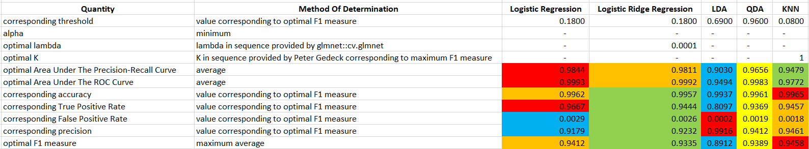

<!--- Below are global settings for knitr. You can override any of them by adding the changes to individual chunks --->
```{r global_options, include = FALSE}
# This chunk is called global_options. Due to `include = FALSE`, when the document is rendered, the chunk will be executed, but the results and code will not be included in the rendered document
knitr::opts_chunk$set(
    error = TRUE, # Keep compiling upon error
    collapse = FALSE, # code and corresponding output appear in knit file in separate blocks
    echo = TRUE, # echo code by default
    comment = "#", # change comment character
    #fig.width = 5.5, # set figure width
    fig.align = "center", # set figure position
    #out.width = "49%", # set width of displayed images
    warning = TRUE, # do not show R warnings
    message = TRUE # do not show R messages
)
```

# Introduction

In this project, we build a model that would help us locate people displaced by the earthquake in Haiti in $2010$. More specifically, we build in a timely manner an accurate model that classifies pixels in geo-referenced aerial images of Haiti in $2010$ as depicting blue tarps or depicting objects that are not blue tarps. People whose homes were destroyed by the earthquake often created temporary shelters using blue tarps. Blue tarps were good indicators of where displaced people lived.

# Data

Our training data was collected likely by applying a Region Of Interest (ROI) Tool to high-resolution, orthorectified / geo-referenced image of Haiti in 2010. The image is presented in Figure 1 and is sourced from `HaitiOrthorectifiedImage.tif` at [Pixel Values from Images over Haiti](https://www.kaggle.com/datasets/billbasener/pixel-values-from-images-over-haiti?datasetId=1899167). One ROI tool is described at [Region of Interest (ROI) Tool](https://www.l3harrisgeospatial.com/docs/regionofinteresttool.html). Classes may be assigned to pixels by defining Regions Of Interest.

{#id .class height=25%}

According to [What is orthorectified imagery?](https://www.esri.com/about/newsroom/insider/what-is-orthorectified-imagery/), an orthorectified image is an accurately georeferenced image that has been processed so that all pixels are in an accurate $(x, y)$ position on the ground. Orthorectified images have been processed to apply corrections for optical distortions from the sensor system, and apparent changes in the position of ground objects caused by the perspective of the sensor view angle and ground terrain.

Our training data frame is sourced from `HaitiPixels.csv` at [Pixel Values from Images over Haiti](https://www.kaggle.com/datasets/billbasener/pixel-values-from-images-over-haiti?datasetId=1899167). Our training data frame consists of $63,241$ observations. Each observation consists of a class in the set $\{Vegetation, \ Soil, \ Rooftop, \ Various \ Non-Tarp, \ Blue \ Tarp\}$ and a pixel. A pixel is a colored dot. A pixel is represented by a tuple of intensities of color $Red$, $Green$, and $Blue$ in the range $0$ to $255$. See below head and tail of our training data frame.

```{r}
set.seed(1)
data_frame_of_classes_and_pixels <- read.csv(
    file = "Data_Frame_Of_Classes_And_Pixels.csv"
)
head(x = data_frame_of_classes_and_pixels, n = 2)
tail(x = data_frame_of_classes_and_pixels, n = 2)
```

We conduct exploratory data analysis by considering the distributions of intensities of color $Red$, $Green$, and $Blue$. See Figures 3, 4, and 5. No distribution of intensities of color is normal.

```{r, fig.cap = "Distribution Of Intensities Of Color Red", fig.width = 2.625, fig.height = 1.875}
library(TomLeversRPackage)
plot_distribution(data_frame_of_classes_and_pixels, "Red", "red")
```

```{r, fig.cap = "Distribution Of Intensities Of Color Green", fig.width = 2.625, fig.height = 1.875}
plot_distribution(data_frame_of_classes_and_pixels, "Green", "green")
```

```{r, fig.cap = "Distribution Of Intensities Of Color Blue", fig.width = 2.625, fig.height = 1.875}
plot_distribution(data_frame_of_classes_and_pixels, "Blue", "blue")
```

We examine the distribution of classes (such as $Blue \ Tarp$) in a space defined by intensities of color $Red$, $Green$, and $Blue$. See Figure 2. The intensity space for pixels representing blue tarps is distinct from the intensity sapce for pixels representing objects that are not blue tarps.

```{r, fig.cap = "Distribution Of Classes In Intensity Space"}
distribution_of_classes_in_intensity_space <- plotly::plot_ly(
    data = data_frame_of_classes_and_pixels,
    x = ~Red,
    y = ~Green,
    z = ~Blue,
    color = ~Class,
    type = "scatter3d",
    mode = "markers",
    colors = c("blue", "black", "brown", "orange", "green")
)
htmlwidgets::saveWidget(
    widget = distribution_of_classes_in_intensity_space,
    file = "distribution_of_classes_in_intensity_space.html"
)
webshot2::webshot(
    url = "distribution_of_classes_in_intensity_space.html",
    file = "distribution_of_classes_in_intensity_space.png"
)
```

# Methods

## Choosing A Binary Classifier

Since the intensity space for pixels representing blue tarps is distinct from the intensity space for pixels representing objects that are not blue tarps, we consider our optimal model to be a binary classifier that classifies pixels as depicting blue tarps or depicting objects that are not blue tarps. We may ignore non-binary classifiers that predict probabilities for all classes and may be used to locate pixels that more likely depict blue tarps than objects that are not blue tarps.

## Choosing A Performance Metric

A threshold is a probability. A model classifies a pixel as representing a blue tarp if the probability that the pixel represents a blue tarp that the model predicts is greater than the threshold. False Positive Rate (FPR) is the ratio of false positives to actual negatives. Precision / Positive Predictive Value (PPV) is the ratio of true positives to predicted positives. Recall / True Positive Rate (TPR) is the ratio of true positives to actual positives. An F1 measure is the harmonic mean of PPV and TPR. A decimal of true positives is the ratio of number of true positives to total number of predictions. All of these quantities lie between $0$ and $1$.

Receiver Operator Characteristic (ROC) graphs are graphs of TPR Vs. FPR for different thresholds. According to [ROC and AUC, Clearly Explained!](https://www.youtube.com/watch?v=4jRBRDbJemM), the Area Under The Curve (AUC) of an ROC graph "makes it easy to compare one ROC curve to another" and to compare one binary classifier to another. If the AUC for one ROC curve is greater than the AUC for another ROC curve, the binary classifier with the former ROC curve is better than the binary classifier with the latter ROC curve. A given model's threshold may be tuned so that its FPR is close to $0$ and its TPR is close to $1$. We may consider maximizing ROC AUC among binary classifiers and tuning a binary classifier's thresholds to minimize the distance between the corresponding point (FPR, TPR) and (0, 1).

"People often replace the False Positive Rate with Precision... If there were lots of samples that were not [Blue Tarps] relative to the number of [Blue Tarp] samples, then Precision might be more useful than the False Positive Rate. This is because Precision does not include the number of True Negatives in its calculation, and is not effected by the imbalance. In practice, this sort of imbalance occurs when studying a rare [occurrence]. In this case, the study will contain many more [pixels not corresponding to blue tarps than corresponding to blue tarps]. We may consider maximizing PR AUC among binary classifiers and tuning a binary classifier's thresholds to minimize the distance between the corresponding point (TPR, PR) and (1, 1).

According to [Category graph: Precision-Recall vs. Threshold](https://www.ibm.com/docs/en/contentclassificatio/8.8?topic=analysis-category-graph-precision-recall-vs-threshold), "The ideal threshold setting is the highest possible recall and precision rate. This goal is not always achievable, because the higher the recall rate, the lower the precision rate, and vice versa. Setting the most appropriate threshold for a category is a trade-off between these two rates." We consider the ideal threshold setting to correspond to the highest F1 measure.

When tuning hyperparameter threshold, $\lambda$ for Logistic Ridge Regression models, and $K$ for KNN models, we prioritize TPR at least as much as PPV. We prioritize identifying as many positives correctly as possible over having predicted positives be correct. We recommend models with thresholds less than or equal to the threshold $t$ that corresponds to the maximum F1 measure and that is least. Note that PPV will decrease more rapidly than TPR will increase as threshold decreases below $t$. Our ideal threshold may be $t$ or may be the highest threshold less than $t$ at which the derivative of Average PPV vs. Threshold is $1$.

## Data Frame For Modeling

In order to build binary classifiers, we create a data frame with a column of indicators of whether of not a pixel depicts a blue tarp instead of a column of classes. We add columns corresponding to normalized intensities and intensities normalized after transforming by the natural logarithm, the square root, the square, and interactions. We normalize as opposed to standardize intensities given that distributions of intensity are not normal. We shuffle the rows in the data frame.

```{r}
number_of_observations <- nrow(data_frame_of_classes_and_pixels)
column_of_indicators <- rep(0, number_of_observations)
condition <- data_frame_of_classes_and_pixels$Class == "Blue Tarp"
column_of_indicators[condition] <- 1
factor_of_indicators <- factor(column_of_indicators)
data_frame_of_indicators_and_pixels <- data.frame(
    Indicator = factor_of_indicators,
    Normalized_Red = normalize_vector(data_frame_of_classes_and_pixels[, "Red"]),
    Normalized_Green = normalize_vector(data_frame_of_classes_and_pixels[, "Green"]),
    Normalized_Blue = normalize_vector(data_frame_of_classes_and_pixels[, "Blue"]),
    Normalized_Natural_Logarithm_Of_Red =
        normalize_vector(log(data_frame_of_classes_and_pixels[, "Red"])),
    Normalized_Natural_Logarithm_Of_Green =
        normalize_vector(log(data_frame_of_classes_and_pixels[, "Green"])),
    Normalized_Natural_Logarithm_Of_Blue =
        normalize_vector(log(data_frame_of_classes_and_pixels[, "Blue"])),
    Normalized_Square_Root_Of_Red =
        normalize_vector(sqrt(data_frame_of_classes_and_pixels[, "Red"])),
    Normalized_Square_Root_Of_Green =
        normalize_vector(sqrt(data_frame_of_classes_and_pixels[, "Green"])),
    Normalized_Square_Root_Of_Blue =
        normalize_vector(sqrt(data_frame_of_classes_and_pixels[, "Blue"])),
    Normalized_Square_Of_Red =
        normalize_vector(I(data_frame_of_classes_and_pixels[, "Red"]^2)),
    Normalized_Square_Of_Green =
        normalize_vector(I(data_frame_of_classes_and_pixels[, "Green"]^2)),
    Normalized_Square_Of_Blue =
        normalize_vector(I(data_frame_of_classes_and_pixels[, "Blue"]^2)),
    Normalized_Interaction_Of_Red_And_Green = normalize_vector(
        as.numeric(
            interaction(
                data_frame_of_classes_and_pixels$Red,
                data_frame_of_classes_and_pixels$Green
            )
        )
    ),
    Normalized_Interaction_Of_Red_And_Blue = normalize_vector(
        as.numeric(
            interaction(
                data_frame_of_classes_and_pixels$Red,
                data_frame_of_classes_and_pixels$Blue
            )
        )
    ),
    Normalized_Interaction_Of_Green_And_Blue = normalize_vector(
        as.numeric(
            interaction(
                data_frame_of_classes_and_pixels$Green,
                data_frame_of_classes_and_pixels$Blue
            )
        )
    )
)
vector_of_random_indices <- sample(1:number_of_observations)
data_frame_of_indicators_and_pixels <-
    data_frame_of_indicators_and_pixels[vector_of_random_indices, ]
t(data_frame_of_indicators_and_pixels[1, ])
```

## Grid Search

We conduct a grid search for an optimal binary classifier according to the $F1 measure$. The primary dimension of our grid is type of binary classifier. We compare Logistic Regression, Logistic Ridge Regression, LDA, QDA, and KNN binary classifiers. The models other than KNN binary classifiers are relatively inflexible with high bias and low variance. KNN binary classifiers may be flexible when $K$ is approximately $1$ or flexible as $K$ approaches the number of observations in our training data set $n$.

The secondary dimension of our grid is the set of predictive terms. We consider binary classifiers with the terms in the above output other than $Indicator$. Per UVA courses Linear Models For Data Science and Introduction To Statistical Learning, these predictive terms involve common transformations of predictors.

The third dimension of our grid is value of primary hyperparameter. For Logistic Ridge Regression binary classifiers, the primary hyperparameter is $\lambda$. Logistic Ridge Regression models are penalized for inclusion of predictive terms proportionally to $\lambda$; setting $\lambda$ to be greater than $0$ may decrease the variance and increase the performance of Logistic Ridge Regression binary classifiers. For K Nearest Neighbors (KNN) binary classifiers, the primary hyperparameter is $K$. The class of a test observation depends on determining the classes of the $K$ nearest neighboring observations in the training data set. A KNN binary classifier with $K = 1$ is relatively flexible with low bias and high variance; such a model may overfit the training data and identify patterns with performance that is less than ideal. A KNN binary classifier with $K = n$ predicts that all observations have one class and has high bias and low variance. A KNN binary classifier with $1 < K < n$ may perform best.

The fourth dimension of our grid is value of threshold. Varying the threshold according to which a binary classifier classifies an observations as corresponding to a blue tarp or not will result in different numbers of false negatives, false positives, true negatives, and true positives and different F1 measures. We seek to maximize F1 measure.

According to *An Introduction to Statistical Learning (Second Edition)* by James et al., for models with categorical predictors such as binary classifiers, "$k$-fold cross validation involves randomly dividing a set of observations into $k$ groups, or folds, of approximately equal size. The first fold is treated as a validation set, and the method is fit on the remaining $k - 1$ folds." A performance metric like F1 measure is "computed on the observations in the held-out fold. This procedure is repeated $k$ times; each time, a different group of observations is treated as a validation set. This process results in $k$ estimates of the" performance metric, $F_1, F_2, ..., F_k$. "The $k$-fold cross validation estimate is computed by averaging these values".

"[W]e are interested only in the location of the [maximum] point in the estimated test [F1 measure] curve. This is because we might be performing cross-validation on a number of statistical learning methods, or on a single method using different [hyperparameters], in order to identify the method that results in the [highest F1 measure. D]espite the fact that they sometimes [misestimate] the true test [F1 measure, most] of the CV curves [of F1 measure vs. threshold] come close to identifying the correct [threshold] corresponding to the [highest F1 measure]."

"[T]here is some variability in the CV estimates as a result of the variability in how the observations are divided into ten folds. But this variability is typically much lower than the variability in the test [F1 measures] that result from the validation set approach."

As described below, we apply cross validation to averaging performance metrics and choosing $\lambda$ for Logistic Ridge Regression models and $K$ for KNN models. We apply cross validation to averaging performance metrics using `rsample::vfold_cv` by passing `vfold_cv` our full data frame of indicators and pixels and specifications of numbers of partitions of the data set and times to repat $v$-fold partitioning. We apply cross validation to choosing $\lambda$ and $K$ using `caret::train` by passing `train` a `caret::trainControl` constructed with `method = "cv"`.

To search for an optimal Logistic Regression binary classifier, we perform manual bidirectional selection. For each formula, we perform $10$-fold cross validation. For each fold, we record $100$ thresholds and corresponding performance metrics including F1 measure. For each formula, we record $100$ thresholds and corresponding average performance metrics. For each formula, we find the maximum average F1 measure. For each formula, we choose the threshold that yields the highest maximum average F1 measure. We choose the Logistic Regression binary classifier with the formula and threshold with the highest maximum average F1 measure. For our optimal Logistic Regression binary classifier with optimal formula and optimal threshold, we provide a plot of Average Performance Metrics Vs. Threshold, a Precision-Recall Curve, an ROC curve, and a data frame of optimal performance metrics.

To describe bidirectional selection in detail, we determine the maximum average F1 measure for Logistic Regression binary classifiers with formula $Indicator \sim normalize(Red)$. Similarly, we calculate the maximum average F1 measure for Logistic Regression binary classifiers with formula $Indicator \sim normalize(Green), Indicator \sim normalize(Blue), ..., Indicator \sim normalize\left(Blue^2\right)$. The Logistic Regression binary classifiers with formula $Indicator \sim normalize(Blue)$ have the highest maximum average F1 measure of $0.445$. We consider the maximum average F1 measures for Logistic Regression binary classifiers with formulas $Indicator \sim normalize(Blue) + normalize(Red), ..., Indicator \sim normalize(Blue) + normalize(Green : Blue)$. The Logistic Regression binary classifiers with formula $Indicator \sim normalize(Blue) + normalize(Red)$ have the highest maximum average F1 measure of $0.931$. We have already considered the maximum average F1 measures for logistic binary classifiers with formulas $Indicator \sim normalize(Red)$ and $Indicator \sim normalize(Blue)$. We consider the maximum average F1 measures for Logistic Regression binary classifiers with formulas $Indicator \sim normalize(Blue) + normalize(Red) + normalize(Green), ..., Indicator \sim normalize(Blue) + normalize(Red) + normalize(Green:Blue)$. The Logistic Regression binary classifiers with formula $Indicator \sim normalize(Blue) + normalize(Red) + normalize\left(Green^2\right)$ have the highest maximum average F1 measure of $0.942$. The maximum average F1 measure for Logistic Regression binary classifiers with formula $Indicator \sim normalize(Red) + normalize\left(Green^2\right)$ is $0.449$. We consider the maximum average F1 measures for Logistic Regression binary classifiers with formulas $Indicator \sim normalize(Blue) + normalize(Red) + normalize\left(Green^2\right) + normalize(Green), ..., Indicator \sim normalize(Blue) + normalize(Red) + normalize\left(Green^2\right) + normalize(Green:Blue)$. None of these binary classifiers have maximum average F1 measures greater than $0.942$.

Our optimal Logistic Regression binary classifier has formula $Indicator \sim normalize(Blue) + normalize(Red) + normalize\left(Green^2\right)$. The maximum average F1 measure is $0.942$; the corresponding threshold is $0.18$.

Average accuracy is nearly $1$ for about $90$ percent of thresholds. Average F1 measure is nearly $0.942$ for thresholds between about $0.1$ and about $0.4$. Average PPV increases linearly from a threshold of about $0.1$ to $1$. Average TPR increases linearly from a threshold of about $0.95$ to $0$. A Precision-Recall curve has an AUC of $0.984$. An ROC curve has an AUC of $0.999$.

```{r, eval = TRUE}
# "glm.fit: fitted probabilities numerically 0 or 1" occurs due to predicted
# probabilities of the Logistic Regression binary classifier being close to 0 and 1.
# "collapsing to unique ’x’ values" is an artifact of MESS::auc.
summary_of_performance <- summarize_performance_of_cross_validated_models_using_dplyr(
    type_of_model = "Logistic Regression",
    formula = Indicator ~ Normalized_Blue + Normalized_Red + Normalized_Square_Of_Green,
    data_frame = data_frame_of_indicators_and_pixels
)
```

```{r, fig.cap = "Prediction Metrics Vs. Thresholds For Logistic Regression Model With Formula Indicator vs. Normalized Blue + Normalized Red + Normalized Square Of Green", eval = TRUE}
summary_of_performance$plot_of_performance_metrics_vs_threshold
```

```{r, fig.width = 2.625, fig.height = 1.875, fig.show = "hold", fig.cap = "PR And ROC Curves For Logistic Regression Model With Formula Indicator vs. Normalized Blue + Normalized Red + Normalized Square Of Green", eval = TRUE}
summary_of_performance$PR_curve
summary_of_performance$ROC_curve
summary_of_performance$data_frame_of_optimal_performance_metrics
```

To search for an optimal Logistic Ridge Regression binary classifier, we perform manual bidirectional selection as above.

For a given formula, before cross validation, we search for one value of hyperparameter $\lambda$. We use `caret::train` to choose $\lambda = 0.000123$ for all of our Logistic Ridge Regression models. According to the [documentation for `caret::train`](https://www.rdocumentation.org/packages/caret/versions/4.47/topics/train), `caret::train` "sets up a grid of tuning parameters for a number of classification and regression routines, fits each model, and calculates a resampling based performance measure". Our inputs include our formula specifying response and predictive terms, our full data frame of indicators and pixels, the method "glmnet", the metric "F1_measure", a `trainControl` object, and a data frame containing one row for each combination of $\alpha = 0$ and value of $\lambda$ to be evaluated. We construct the `trainControl` object with method "cv" denoting resampling method Cross Validation and summary function `calculate_F1_measure` to compute F1 measures across resamples. $\alpha = 0$ indicates a combination of ridge regression and lasso regression that is effectively ridge regression.

$\lambda$ is a constant that determines the importance of squares of coefficients to the quantity to be minimized when conducting Logistic Ridge Regression. We may use `glmnet::glmnet` to choose a sequence of values of $lambda$ to be evaluated. According to the [documentation for `glmnet::glmnet`](https://www.rdocumentation.org/packages/glmnet/versions/4.1-7/topics/glmnet), `glmnet` fits "a generalized linear model via penalized maximum likelihood." Our inputs include a matrix of the values of the predictive terms in our data frame of indicators and pixels, a vector of response values, an indication that the generalized linear model is a Logistic Regression model, and $alpha = 0$.

Unfortunately, `glmnet` chooses a sequence of values of $lambda$ with a minimum of $0.0035$. `caret::train` considers the optimal value of $\lambda$ to be this minimum. We assume that the true optimal value of $lambda$ is less than $0.0035$. We use `glmnet::cv.glmnet` to graph $Misclassification \ Error Vs. ln(\lambda)$ for $-9 < ln(-\lambda) < -8$. Misclassification error is an approximation of F1 measure. Our software fails to provide graphs of Performance Metrics Vs. Threshold and PR and ROC curves for some values of $ln(\lambda)$ less than $-9$. We assume that the optimal value of $\lambda$ is less than $exp(-9) = 0.000123$.

Our optimal Logistic Ridge Regression binary classifier has formula $Indicator \sim normalize(Blue) + normalize(Red) + normalize\left(Green^2\right)$. Our optimal value for $\lambda$ is $0.000123$; the maximum average F1 measure is $0.934$; the corresponding threshold is $0.18$.

Average accuracy is nearly $1$ for about $90$ percent of thresholds but in general is not quite as good as for our optimal Logistic Regression binary classifier. Average F1 measure is nearly $0.934$ for maybe $6$ percent of thresholds; the maximum average F1 measure is lower than that for our optimal Logistic Regression binary classifier and about the maximum for fewer thresholds. Average PPV increases logarithmically from a threshold of about $0.1$ to $1$. From about the optimal threshold PPV is greater than that for our optimal Logistic Regression binary classifier. Average TPR increases in the manner of $y = sqrt(x)$ from a threshold of about $1$ to $0$. Average TPR is generally less than that for our optimal Logistic Regression binary classifier. We prioritize TPR over precision but under F1 measure. A Precision-Recall curve has an AUC of $0.981$. An ROC curve has an AUC of $0.999$. These AUC's are less than those for our optimal Logistic Regression binary classifier.

```{r, eval = TRUE, fig.width = 3.5, fig.height = 2.5}
formula <-
    Indicator ~ Normalized_Natural_Logarithm_Of_Blue + Normalized_Square_Root_Of_Red
full_model_matrix <-
    model.matrix(object = formula, data = data_frame_of_indicators_and_pixels)[, -1]
sequence_of_lambda_values <- exp(seq(-9, -8, length = 100))
the_cv.glmnet <- glmnet::cv.glmnet(
    x = full_model_matrix,
    y = data_frame_of_indicators_and_pixels$Indicator,
    family = "binomial",
    type.measure = "class",
    alpha = 0,
    lambda = sequence_of_lambda_values
)
plot(the_cv.glmnet)
optimal_lambda <- the_cv.glmnet$lambda.min
optimal_lambda
summary_of_performance <- summarize_performance_of_cross_validated_models_using_dplyr(
    type_of_model = "Logistic Ridge Regression",
    formula = formula,
    data_frame = data_frame_of_indicators_and_pixels,
    optimal_lambda = optimal_lambda
)
```

```{r, fig.cap = "Prediction Metrics Vs. Thresholds For Logistic Ridge Regression Model With Formula Indicator Vs. Normalized Natural Logarithm Of Blue + Normalized Square Root Of Red", eval = TRUE}
summary_of_performance$plot_of_performance_metrics_vs_threshold
```

```{r, fig.width = 2.625, fig.height = 1.875, fig.show = "hold", fig.cap = "PR And ROC Curves For Logistic Ridge Regression Model With Formula Indicator Vs. Normalized Natural Logarithm Of Blue + Normalized Square Root Of Red", eval = TRUE}
summary_of_performance$PR_curve
summary_of_performance$ROC_curve
summary_of_performance$data_frame_of_optimal_performance_metrics
```

To search for an optimal LDA binary classifier, we perform manual bidirectional selection as above. Our optimal LDA binary classifier has formula $Indicator \sim normalize(Blue) + normalize(Red^2) + normalize\left(Green^2\right)$. The maximum average F1 measure is $0.891$; the corresponding threshold is $0.69$.

Average accuracy is nearly $1$ for about $95$ percent of thresholds but in general is not quite as good as that for our optimal Logistic Regression binary classifier or that for our optimal Logistic Ridge Regression binary classifier. Average F1 measure is nearly $0.891$ for maybe $6$ percent of thresholds; the maximum average F1 measure is lower than that for our optimal Logistic Regression binary classifier and that for our optimal Logistic Ridge Regression binary classifier. The maximum average F1 measure is about $0.891$ for about the same percent of thresholds as for our optimal Logistic Ridge Regression binary classifier. Average PPV increases logarithmically from a threshold of about $0$ to our optimal threshold of $0.69$, at which point average PPV jumps up to $1$. From about a threshold of $0.69$ PPV is greater than that for our optimal Logistic Regression binary classifier and equal to that for our optimal Logistic Ridge Regression binary classifier. For thresholds lower than our optimal threshold of $0.69$ PPV is less than those for our optimal Logistic Regression and Logistic Ridge Regression binary classifiers. Average TPR generally has a similar trend and is less than that for our optimal Logistic Regression binary classifier. Average TPR is generally less than that for our optimal Logistic Ridge Regression binary classifier for thresholds less than $0.38$ and greater than that for our optimal Logistic Ridge Regression binary classifier for thresholds greater than $0.38$. We prioritize TPR over precision but under F1 measure. A Precision-Recall curve has an AUC of $0.903$. An ROC curve has an AUC of $0.949$. These AUC's are less than those for our optimal Logistic Regression and Logistic Ridge Regression binary classifiers.

```{r, eval = TRUE}
summary_of_performance <- summarize_performance_of_cross_validated_models_using_dplyr(
    type_of_model = "LDA",
    formula = Indicator ~ Normalized_Blue + Normalized_Square_Of_Red + Normalized_Square_Of_Green,
    data_frame = data_frame_of_indicators_and_pixels
)
```

```{r, fig.cap = "Prediction Metrics Vs. Thresholds For Linear Discriminant Analysis Model With Formula Indicator Vs. Normalized Blue + Normalized Square Of Red + Normalized Square Of Green", eval = TRUE}
summary_of_performance$plot_of_performance_metrics_vs_threshold
```

```{r, fig.width = 2.625, fig.height = 1.875, fig.show = "hold", fig.cap = "PR And ROC Curves For Linear Discriminant Analysis Model With Formula Indicator Vs. Normalized Blue + Normalized Square Of Red + Normalized Square Of Green", eval = TRUE}
summary_of_performance$PR_curve
summary_of_performance$ROC_curve
summary_of_performance$data_frame_of_optimal_performance_metrics
```

To search for an optimal QDA binary classifier, we perform manual bidirectional selection as above. Our optimal QDA binary classifier has formula $Indicator \sim normalize\left(Blue^2\right) + normalize\left(Red^2\right) + normalize\left(Red\right)$. The maximum average F1 measure is $0.939$; the corresponding threshold is $0.960$.

Average accuracy is nearly $1$ for about $95$ percent of thresholds but in general is not quite as good as that for our optimal Logistic Regression binary classifier or that for our optimal Logistic Ridge Regression binary classifier. In generally average accuracy is better than for our LDA binary classifier. Average F1 measure is nearly $0.939$ for few thresholds; the maximum average F1 measure is lower than that for our optimal Logistic Regression binary classifier and that for our optimal Logistic Ridge Regression binary classifier but higher than that for our LDA binary classifier. Average PPV increases in the manner of $y = tan(x)$ from a threshold of about $0$ to $1$. In general PPV is less than that for one of the preceding models. Average TPR is nearly $1$ for thresholds less than $0.75$. We prioritize TPR over precision but under F1 measure. A Precision-Recall curve has an AUC of $0.966$. An ROC curve has an AUC of $0.998$. These AUC's are less than those for our optimal Logistic Regression and Logistic Ridge Regression binary classifiers but greater than that for our LDA binary classifier.

```{r, eval = TRUE}
summary_of_performance <- summarize_performance_of_cross_validated_models_using_dplyr(
    type_of_model = "QDA",
    formula = Indicator ~ Normalized_Square_Of_Blue + Normalized_Square_Of_Red + Normalized_Red + Normalized_Natural_Logarithm_Of_Blue,
    data_frame = data_frame_of_indicators_and_pixels
)
```

```{r, fig.cap = "Prediction Metrics Vs. Thresholds For Quadratic Discriminant Analysis Model With Formula Indicator Vs. Normalized Square Of Blue + Normalized Square Of Red + Normalized Red + Normalized Natural Logarithm Of Blue", eval = TRUE}
summary_of_performance$plot_of_performance_metrics_vs_threshold
```

```{r, fig.width = 2.625, fig.height = 1.875, fig.show = "hold", fig.cap = "PR And ROC Curves For Quadratic Discriminant Analysis Model With Formula Indicator Vs. Normalized Square Of Blue + Normalized Square Of Red + Normalized Red + Normalized Natural Logarithm Of Blue", eval = TRUE}
summary_of_performance$PR_curve
summary_of_performance$ROC_curve
summary_of_performance$data_frame_of_optimal_performance_metrics
```

To search for an optimal $K$ Nearest Neighbors binary classifier, we perform manual bidirectional selection as above.

For a given formula, before cross validation, we search for one value of hyperparameter $K$. We use `caret::train` to choose $K = 3$ for all of our Logistic Ridge Regression models. According to the [documentation for `caret::train`](https://www.rdocumentation.org/packages/caret/versions/4.47/topics/train), `caret::train` "sets up a grid of tuning parameters for a number of classification and regression routines, fits each model, and calculates a resampling based performance measure". Our inputs include our formula specifying response and predictive terms, our full data frame of indicators and pixels, the method "knn", the metric "F1_measure", a `trainControl` object, and a data frame containing one row for each $K$ to be evaluated. Dr. Peter Gedeck recommended evaluating $K \in [1, 3]$. We construct the `trainControl` object with method "cv" denoting resampling method cross validation and summary function `calculate_F1_measure` to compute F1 measures across resamples. $K$ is a constant that determines the number of neighboring training observations used to determine the probability that a testing observation corresponds to a blue tarp.

See below graph of average F1 measure vs. $K$ for $10$ cross-validated KNN binary classifiers trained on the full data frame of indicators and pixels. `caret::train` chose the value of $K$ for all KNN binary classifiers corresponding to the maximum average F1 measure.

Our optimal $KNN$ binary classifier has formula $Indicator \sim normalize(Red:Blue) + normalize(Green:Blue) + normalize\left(\sqrt{Blue}\right)$. The maximum average F1 measure is $0.946$; the corresponding threshold is $0.080$.

Average accuracy is nearly $1$ for about $100$ percent of thresholds and is better than that for any of the previous binary classifiers. Average F1 measure is nearly $0.946$ for $90$ percent of thresholds; the maximum average F1 measure is higher than that for any previous binary classifier. Average F1 measure, PPV, and TPR all jump to about $0.942$ for a threshold of about $0.1$. A Precision-Recall curve has an AUC of $0.948$. An ROC curve has an AUC of $0.997$. These AUC's are less than those for our optimal Logistic Regression, Logistic Ridge Regression, and QDA binary classifiers but greater than that for our LDA binary classifier.

```{r, eval = TRUE}
summary_of_performance <- summarize_performance_of_cross_validated_models_using_dplyr(
    type_of_model = "KNN",
    formula = Indicator ~ Normalized_Interaction_Of_Red_And_Blue + Normalized_Interaction_Of_Green_And_Blue + Normalized_Square_Root_Of_Blue,
    data_frame = data_frame_of_indicators_and_pixels
)
```

```{r, fig.cap = "Prediction Metrics Vs. Thresholds For KNN Model With Formula Indicator Vs. Normalized Interaction Of Red And Blue And Normalized Interaction Of Green And Blue", eval = TRUE}
summary_of_performance$plot_of_performance_metrics_vs_threshold
```

```{r, fig.width = 2.625, fig.height = 1.875, fig.show = "hold", fig.cap = "PR And ROC Curves For KNN Model With Formula Indicator Vs. Normalized Interaction Of Red And Blue And Normalized Interaction Of Green And Blue", eval = TRUE}
summary_of_performance$PR_curve
summary_of_performance$ROC_curve
summary_of_performance$data_frame_of_optimal_performance_metrics
```

# Performance Table

Per our [Performance Table](https://github.com/tslever/Tom_Levers_Public_Git_Repository/tree/main/UVA/4--Statistical_Learning/Disaster_Relief_Project), our KNN binary classifier with $K = 1$ and threshold $t = 0.080$ has the best optimal F1 measure and corresponding accuracy. Our KNN binary classifier has the second-best corresponding TPR, FPR, and PPV. However, our KNN binary classifier has the second-worst Area Under The Precision-Recall Curve and Area Under The ROC Curve. Our Logistic Regression binary classifier has the best Area Under The Precision-Recall Curve, Area Under The ROC Curve, and corresponding TPR. Our Logistic Regression binary classifier has the second-best corresponding optimal measure and corresponding accuracy. However, our Logistic Regression binary classifier has the worst corresponding FPR and PPV. Beautifully, our QDA binary classifier is completely middle of the road. Our Logistic Ridge Regression binary classifier is second-best in Area Under The Precision-Recall Curve and Area Under The ROC curve and second-worst in everything else. Our LDA binary classifier has the best corresponding FPR and PPV and is worst in everything else.



# Conclusions

We consider how the number of refugees to visit may change with PPV. We assume that the testing data consists of actual indicators and random pixels from the training image. Suppose PPV $PPV = TP / \hat{P} = 0.944$. Suppose decimal of true positives $TPD = TP / n = 0.0296$. The decimal of predicted positives $PPD = \hat{P} / n = TPD / PPV = \frac{TP/n}{TP/\hat{P}} = 0.0296 / 0.944 = 0.0313$. The number of pixels in our training image is $4441 \times 6833 = 30,345,353$. The number of pixels in our training image that might be predicted to represent blue tarps is $949,810$. Considering a blue tarp in the top left corner of our training image, the number of pixels representing one blue tarp may be $36 \times 36 = 1,296$. The predicted number of blue tarps in our training image may be $733$. We assume that there is one refugee per blue tarp. If we change PPV by a factor of -0.139 to 0.8125, the predicted number of blue tarps in our training image may increase by $120$ to $853$. The number of true positives may increase by $4$ and the number of false negatives may decrease by $4$.

Suppose the width of our training image is $1,500 \ ft$. Then our training image's height is about $2,308 \ ft$ and its area is about $0.124 \ mi^2$. Suppose the area of Léogâne is $148.7 \ mi^2. There are about $1,200$ areas like that depicted in our training image in Léogâne.